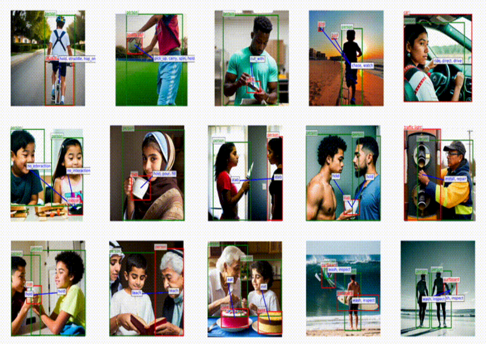
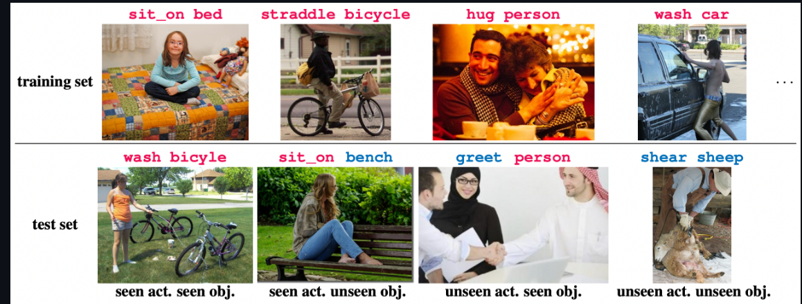

# AI & DL Presentation: Computer Vision

## Part1 引言
- 简介：计算机视觉的定义和重要性
- 历史简览：从早期研究到深度学习的革新
- 有趣的演示（Demo）：实时对象识别，面部识别门禁系统。比较新的模型演示，比如上次提到的蒙娜丽莎：https://humanaigc.github.io/emote-portrait-alive/ 。或者我觉得一些比较能catch大家的注意力的新颖的可演示的模型会比较好。

> 在这里我比较希望可以有一张我们pre的整个的流程图。，比较清晰一点。

## Part2 计算机视觉的识别
### 单目视觉
- 定义和应用场景
- 技术原理：如何通过单个摄像头捕获深度信息
- 前沿Demo：实时跟踪与识别，增强现实应用

### 双目视觉
- 定义和应用场景
- 技术原理：使用两个摄像头模拟人类的立体视觉
- 前沿Demo：深度感知，三维重建

### 图像分类与目标检测
#### 理论框架

CNNs，R-CNN，YOLO，SSD，RNNs，BiLSTM等等。

> 我觉得在这里如果都介绍时间可能会不太够，有两个方案：1.每一个model我们简要介绍一下，一个model一张概念图和一张理论公式图加一点点描述。2.我们着重介绍部分model，比如后面有进一步用到的model或者是比较核心的，然后对于剩下的内容简单提一提。

#### 应用案例分析HOI（Human Object Interacting）

> 我之前看到过一个很有意思的model，可以output出人体的骨骼骨架变动，这个如果我们去调用一些生成一个demo会很有意思。

##### SynHOI

###### 链接

github link: [GitHub - IDEA-Research/DiffHOI: Official implementation of the paper "Boosting Human-Object Interaction Detection with Text-to-Image Diffusion Model"](https://github.com/IDEA-Research/DiffHOI)

paper link: [2305.12252.pdf (arxiv.org)](https://arxiv.org/pdf/2305.12252.pdf)

###### model examples

##### Bongard-HOI

###### Links

github: [GitHub - NVlabs/Bongard-HOI: [CVPR 2022 (oral)\] Bongard-HOI for benchmarking few-shot visual reasoning](https://github.com/NVlabs/Bongard-HOI)

paper: [Bongard-HOI: Benchmarking Few-Shot Visual Reasoning for Human-Object Interactions (zenodo.org)](https://zenodo.org/records/7079175)

###### Description

Bongard-HOI 是一个挑战模型视觉推理能力的数据集，旨在从自然图像中学习和识别人与物体的交互 (HOI)。 它受到经典 Bongard 问题的启发，该问题需要少量概念学习和上下文相关推理。 该数据集包含 1,200 个少样本实例，每个实例由六张图像组成：三张正图和三张负图。 正图像具有共同的 HOI 概念，而负图像与正图像仅在动作标签上有所不同。 该数据集还具有多个测试集，训练和测试 HOI 概念之间有不同程度的重叠，以衡量模型的泛化性能。

###### Dataset examples

#### 前沿Demo

- 实时视频监控分析
- 无人驾驶车辆的环境感知

> 上面是我的大概简单的想法，芸欢应该接触过前面那个？主要就是希望展示效果会好一点。

## Part3 计算机视觉的生成
### 生成对抗网络（GANs）
- 理论介绍：GANs的工作原理
- 应用案例：虚拟内容创作，风格迁移
- 前沿Demo：高清照片生成，深度伪造视频

> 比较常用的VAEs，diffusion，序列生成模型啊都可以讲，可能要根据demo进行取舍。

### 风格迁移

- 技术原理：如何将一种图像风格转移到另一张图片
- 应用案例：艺术作品创作，广告创意
- 前沿Demo：实时风格迁移APP

> 这一部分我给的内容稍微有一点少，因为这部分之前我做的也不是特别多，嗯有一个GAN生成数字的小demo，这个我记得璐璐也跑过，这个或许也可以作为一个展示的demo，因为我电脑上就有一个现有的模型，也是比较

## Par4 计算机视觉的未来发展
### 多模态学习
- 定义：结合视觉、语言和声音等多种模态的学习
- 技术原理：融合不同类型数据的深度学习模型
- 前沿Demo：自动图像字幕生成，多模态情感分析

> 其实前面HOI部分应该就会涉及到多模态的融合，在这里主要是希望有一些延展，可能会把一些更前沿的技术放在这里会更好。Sora？但是我还没有查，Sora到现在的技术是否有真正的公开？

### 增强现实（AR）和虚拟现实（VR）
- 技术发展：从计算机视觉到沉浸式体验
- 应用案例：游戏，教育，零售
- 前沿Demo：AR购物体验，VR手术模拟

## Part5 总结与展望
- 计算机视觉的社会影响
- 未来的发展趋势和挑战
- 鼓励创新和研究的重要性

## 附录
- 参考文献
- 相关资源链接
- 问答回合

> 我比较希望的是大家可以在每一部分都给出demo和对应的运行的方式，可以从Hugging face，Kaggle和Github去找一找资料什么的。真正跑过的和只放一个别人的结果串起来的肯定不一样。
>
> 尤其是大家在整理资料的时候，每一次上传可以直接跑的demo或者是相关的code，以及一些内容，我希望可以在README.md里面进行更新，开一个二级标题，格式为日期 更新人 更新内容主题，example：2024.03.08 Get push structure