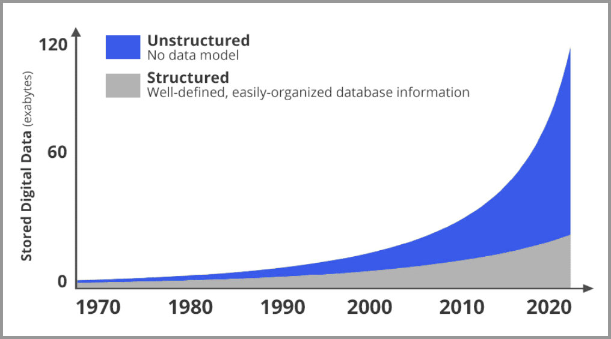
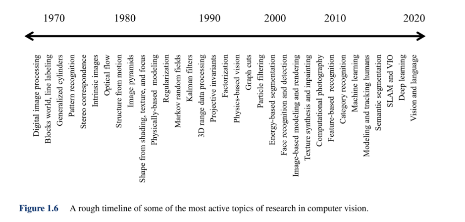
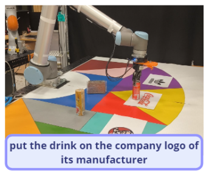

# 一、引言

## 1.  简介：计算机视觉的定义和重要性

### 1.1 定义

​	**计算机视觉，**属于人工智能领域，程序通过识别相机提供的数字化图像中表示的对象，使计算机能够“看到”。计算机可以得到大量的视觉图像数据集，并识别这些图像中的特征和模式，然后计算机可以将其应用于其他图像。

​	**Computer vision**, field of [artificial intelligence](https://www.britannica.com/technology/artificial-intelligence) in which programs attempt to identify objects represented in digitized images provided by cameras, thus enabling [computers](https://www.britannica.com/technology/computer) to “see.” Computers can be given a large data set of visual images and identify features and patterns within those images that the computers can then apply to other images. 

（[Computer vision | Definition, Examples, Applications, & Facts | Britannica](https://www.britannica.com/technology/computer-vision)）

### 1.2重要性

​	人的大脑皮层， 有差不多 70% 都是在处理视觉信息。 是人类获取信息最主要的渠道，没有之一。

​	在网络世界，照片和视频（图像的集合）也正在发生爆炸式的增长！

​	下图是网络上新增数据的占比趋势图。灰色是结构化数据，蓝色是非结构化数据（大部分都是图像和视频）。可以很明显的发现，图片和视频正在以指数级的速度在增长。

​	而在计算机视觉出现之前，图像对于计算机来说是黑盒的状态。

​	一张图片对于机器只是一个文件。机器并不知道图片里的内容到底是什么，只知道这张图片是什么尺寸，多少MB，什么格式的。

如果计算机、人工智能想要在现实世界发挥重要作用，就必须看懂图片！这就是计算机视觉要解决的问题。

## 2. 历史简览：从早期研究到深度学习的革新

**1、20世纪50年代，主题是二维图像的分析和识别**

​	1959年，神经生理学家David Hubel和Torsten Wiesel通过猫的视觉实验，首次发现了视觉初级皮层神经元对于移动边缘刺激敏感，发现了视功能柱结构，为视觉神经研究奠定了基础——促成了计算机视觉技术40年后的突破性发展，奠定了深度学习之后的核心准则。

> 图片来源 [https://www.sohu.com/a/302537186_114877](https://link.zhihu.com/?target=https%3A//www.sohu.com/a/302537186_114877)

​	1959年，Russell和他的同学研制了一台可以把图片转化为被二进制机器所理解的灰度值的仪器——这是第一台数字图像扫描仪，处理数字图像开始成为可能。

​	这一时期，研究的主要对象如光学字符识别、工件表面、显微图片和航空图片的分析和解释等。

**2、20世纪60年代，开创了三维视觉理解为目的的研究**

​	1965年， Lawrence Roberts《三维固体的机器感知》描述了从二维图片中推导三维信息的过程。——现代计算机视觉的前导之一，开创了理解三维场景为目的的计算机视觉研究。他对积木世界的创造性研究给人们带来极大的启发，之后人们开始对积木世界进行深入的研究，从边缘的检测、角点特征的提取，到线条、平面、曲线等几何要素分析，到图像明暗、纹理、运动以及成像几何等，并建立了各种数据结构和推理规则。

> 图片来源 [http://cs231n.stanford.edu/](https://link.zhihu.com/?target=http%3A//cs231n.stanford.edu/)

​	1966， MITAI实验室的Seymour Papert教授决定启动夏季视觉项目，并在几个月内解决机器视觉问题。Seymour和Gerald Sussman协调学生将设计一个可以自动执行背景/前景分割，并从真实世界的图像中提取非重叠物体的平台。——虽然未成功，但是计算机视觉作为一个科学领域的正式诞生的标志。

​	1969年秋天，贝尔实验室的两位科学家Willard S. Boyle和George E. Smith正忙于电荷耦合器件（CCD）的研发。它是一种将光子转化为电脉冲的器件，很快成为了高质量数字图像采集任务的新宠，逐渐应用于工业相机传感器，标志着计算机视觉走上应用舞台，投入到工业机器视觉中。

**3、20世纪70年代，出现课程和明确理论体系**

​	70年代中期，麻省理工学院（MIT）人工智能（AI）实验室：CSAIL正式开设计算机视觉课程。

> 图片来源 [https://www.sohu.com/a/84165588_297710](https://link.zhihu.com/?target=https%3A//www.sohu.com/a/84165588_297710)

​	1977年David Marr在MIT的AI实验室提出了，计算机视觉理论（Computational Vision），这是与 Lawrence Roberts当初引领的积木世界分析方法截然不同的理论。计算机视觉理论成为80年代计算机视觉重要理论框架，使计算机视觉有了明确的体系，促进了计算机视觉的发展。

**4、20世纪80年代 ，独立学科形成，理论从实验室走向应用**

​	1980年，日本计算机科学家Kunihiko Fukushima在Hubel和Wiesel的研究启发下，建立了一个自组织的简单和复杂细胞的人工网络——Neocognitron，包括几个卷积层（通常是矩形的），他的感受野具有权重向量（称为滤波器）。这些滤波器的功能是在输入值的二维数组（例如图像像素）上滑动，并在执行某些计算后，产生激活事件（2维数组），这些事件将用作网络后续层的输入。Fukushima的Neocognitron可以说是第一个神经网络，是现代 CNN 网络中卷积层+池化层的最初范例及灵感来源。

​	1982年，David Marr发表了有影响的论文-“愿景：对人类表现和视觉信息处理的计算研究”。基于Hubel和Wiesel的想法视觉处理不是从整体对象开始, David介绍了一个视觉框架，其中检测边缘，曲线，角落等的低级算法被用作对视觉数据进行高级理解的铺垫。同年《视觉》（Marr, 1982）一书的问世，标志着计算机视觉成为了一门独立学科。

​	1982年 日本COGEX公司于生产的视觉系统DataMan，是世界第一套工业光学字符识别（OCR）系统。

​	1989年，法国的Yann LeCun将一种后向传播风格学习算法应用于Fukushima的卷积神经网络结构。在完成该项目几年后，LeCun发布了LeNet-5--这是第一个引入今天仍在CNN中使用的一些基本成分的现代网络。现在卷积神经网络已经是图像、语音和手写识别系统中的重要组成部分。

**5、20世纪90年代，特征对象识别开始成为重点**

​	1997年，伯克利教授Jitendra Malik（以及他的学生Jianbo Shi）发表了一篇论文，描述了他试图解决感性分组的问题。研究人员试图让机器使用图论算法将图像分割成合理的部分（自动确定图像上的哪些像素属于一起，并将物体与周围环境区分开来）

​	1999年， David Lowe 发表《基于局部尺度不变特征（SIFT特征）的物体识别》，标志着研究人员开始停止通过创建三维模型重建对象，而转向基于特征的对象识别。

> 图片来源 [https://wenku.baidu.com/view/152b0a9302020740be1e9b9e.html](https://link.zhihu.com/?target=https%3A//wenku.baidu.com/view/152b0a9302020740be1e9b9e.html)

​	1999年，Nvidia公司在推销Geforce 256芯片时，提出了GPU概念。GPU是专门为了执行复杂的数学和集合计算而设计的数据处理芯片。伴随着GPU发展应用，游戏行业、图形设计行业、视频行业发展也随之加速，出现了越来越多高画质游戏、高清图像和视频。

**6、21世纪初，图像特征工程,出现真正拥有标注的高质量数据集**

​	2001年，Paul Viola 和Michael Jones推出了第一个实时工作的人脸检测框架。虽然不是基于深度学习，但算法仍然具有深刻的学习风格，因为在处理图像时，通过一些特征可以帮助定位面部。该功能依赖于Viola / Jones算法，五年后，Fujitsu 发布了一款具有实时人脸检测功能的相机。

​	2005年，由Dalal & Triggs提出来方向梯度直方图，HOG（Histogramof Oriented Gradients）应用到行人检测上。是目前计算机视觉、模式识别领域很常用的一种描述图像局部纹理的特征方法。

​	2006年，Lazebnik, Schmid & Ponce提出一种利用空间金字塔即 SPM （Spatial Pyramid Matching）进行图像匹配、识别、分类的算法，是在不同分辨率上统计图像特征点分布，从而获取图像的局部信息。

​	2006年，Pascal VOC项目启动。它提供了用于对象分类的标准化数据集以及用于访问所述数据集和注释的一组工具。创始人在2006年至2012年期间举办了年度竞赛，该竞赛允许评估不同对象类识别方法的表现。检测效果不断提高。

​	2006年左右，Geoffrey Hilton和他的学生发明了用GPU来优化深度神经网络的工程方法，并发表在《Science》和相关期刊上发表了论文，首次提出了“深度信念网络”的概念。他给多层神经网络相关的学习方法赋予了一个新名词–“深度学习”。随后深度学习的研究大放异彩，广泛应用在了图像处理和语音识别领域，他的学生后来赢得了2012年ImageNet大赛，并使CNN家喻户晓。

​	2009年，由Felzenszwalb教授在提出基于HOG的deformable parts model(DPM)，可变形零件模型开发，它是深度学习之前最好的最成功的objectdetection & recognition算法。它最成功的应用就是检测行人，目前DPM已成为众多分类、分割、姿态估计等算法的核心部分，Felzenszwalb本人也因此被VOC授予"终身成就奖"。

> 图片来源 [http://www.360doc.com/content/14/0722/16/10724725_396297961.shtml](https://link.zhihu.com/?target=http%3A//www.360doc.com/content/14/0722/16/10724725_396297961.shtml)

**7、2010年-至今 深度学习在视觉中的流行，在应用上百花齐放**

​	2009年，李飞飞教授等在CVPR2009上发表了一篇名为《ImageNet: A Large-Scale Hierarchical Image Database》的论文，发布了ImageNet数据集，这是为了检测计算机视觉能否识别自然万物，回归机器学习，克服过拟合问题，经过三年多在筹划组建完成的一个大的数据集。从10年-17年，基于ImageNet数据集共进行了7届ImageNet挑战赛，李飞飞说"ImageNet改变了AI领域人们对数据集的认识，人们真正开始意识到它在研究中的地位，就像算法一样重要"。ImageNet是计算机视觉发展的重要推动者，和深度学习热潮的关键推动者，将目标检测算法推向了新的高度。

> 图片来源 [http://cs231n.stanford.edu/](https://link.zhihu.com/?target=http%3A//cs231n.stanford.edu/)

​	2012 年，Alex Krizhevsky、Ilya Sutskever 和 Geoffrey Hinton 创造了一个“大型的深度卷积神经网络”，也即现在众所周知的 AlexNet，赢得了当年的 ILSVRC。这是史上第一次有模型在 ImageNet 数据集表现如此出色。论文“ImageNet Classification with Deep Convolutional Networks”，迄今被引用约 7000 次，被业内普遍视为行业最重要的论文之一，真正展示了 CNN 的优点。机器识别的错误率从25%左右。降低了百分之16%左右，跟人类相比差别不大。是自那时起，CNN 才成了家喻户晓的名字。

> 图片来源 [http://cs231n.stanford.edu/](https://link.zhihu.com/?target=http%3A//cs231n.stanford.edu/)

​	2014年，蒙特利尔大学提出生成对抗网络（GAN）：拥有两个相互竞争的神经网络可以使机器学习得更快。一个网络尝试模仿真实数据生成假的数据，而另一个网络则试图将假数据区分出来。随着时间的推移，两个网络都会得到训练，生成对抗网络（GAN）被认为是计算机视觉领域的重大突破。

​	2017-2018 年深度学习框架的开发发展到了成熟期。PyTorch 和 TensorFlow 已成为首选框架，它们都提供了针对多项任务（包括图像分类）的大量预训练模型。

​	近年来，国内外巨头纷纷布局计算机视觉领域，开设计算机视觉研究实验室。以计算机视觉新系统和技术赋能原有的业务，开拓战场。

​	如Facebook的AI Research（FAIR）在视觉方面2016年声称其DeepFace人脸识别算法有着97.35%的识别准确率，几乎与人类不分上下。2017，Lin, Tsung-Yi等提出特征金字塔网络，可以从深层特征图中捕获到更强的语义信息。同时提出Mask R-CNN，用于图像的实例分割任务，它使用简单、基础的网络设计，不需要多么复杂的训练优化过程及参数设置，就能够实现当前最佳的实例分割效果，并有很高的运行效率。

​	2016，亚马逊收购了一支欧洲顶级计算机视觉团队，为Prime Air无人机加上识别障碍和着陆区域的能力。开发无人机送货。2017年亚马逊网络服务（AWS）宣布对其识别服务进行了一系列更新，为云客户提供基于机器学习的计算机视觉功能。客户将能够在数百万张面孔的集合上进行实时人脸搜索。例如，Rekognition可用于验证一个人的图像与现有数据库中的另一个图像相匹配，数据库高达数千万个图像，具有亚秒级延迟。

​	2018年末，英伟达发布的视频到视频生成（Video-to-Video synthesis），它通过精心设计的发生器、鉴别器网络以及时空对抗物镜，合成高分辨率、照片级真实、时间一致的视频，实现了让AI更具物理意识，更强大，并能够推广到新的和看不见的更多场景。

​	2019， BigGAN，同样是一个GAN，只不过更强大，是拥有了更聪明的课程学习技巧的GAN，由它训练生成的图像连它自己都分辨不出真假，因为除非拿显微镜看，否则将无法判断该图像是否有任何问题，因而，它更被誉为史上最强的图像生成器。

​	2020年5月末，Facebook发布新购物AI，通用计算机视觉系统GrokNet让“一切皆可购买”。

**2021年**

​	遮盖图像建模、非Transformer架构、神经辐射场等技术快速发展，成为计算机视觉的热点研究领域；脉冲视觉领域发展，将开辟机器视觉新路线

**2022年**

**1. Transformer统治计算机视觉**

​	Transformer 模型在 2017 年在Attention is All You Need论文中被提出，之后广泛用于深度学习领域，为各种 NLP 任务设定了标准，并开创了大型语言模型 (LLM) 的时代。Vision Transformer (ViT) 于 2020 年底推出，标志着这些基于自我注意的模型在计算机视觉环境中的首次应用。

​	2022年，研究将 Transformer 模型推向了计算机视觉的前沿，在各种任务上实现了最先进的性能。例如：DETR、SegFormer、Swin Transformer和ViT。这个GitHub总结了相当于的基于Transformer的网络。

https://github.com/Yangzhangcst/Transformer-in-Computer-Vision

**2. 以数据为中心的计算机视觉获得牵引力**

​	随着计算机视觉的成熟，越来越多的机器学习开发工作专注于整理、清理和扩充数据。数据质量正在成为性能的瓶颈，行业正朝着数据模型协同设计的方向发展。以数据为中心的机器学习会越来越受欢迎。

​	这一努力的掌舵者是新一波的初创公司——合成数据生成公司（gretel、Datagen、Tonic）和评估、可观察性和实验跟踪工具（Voxel51、Weights & Biases 、CleanLab）——加入现有的标签和注释服务（Labelbox、Label Studio、CVAT、Scale、V7 ) 的努力。

**3. AI 生成的艺术作品**

​	在生成对抗网络 (GAN) 的改进和传播模型的快速发展和迭代之间，AI生成的艺术正在经历只能被描述为复兴的过程。借助Stable Diffusion、Nightcafe、Midjourney和 OpenAI的DALL-E2等工具，现在可以根据用户输入的文本提示生成令人难以置信的细微图像。Artbreeder允许用户将多个图像“培育”成新作品，Meta的Make-A-Video从文本生成视频，而RunwayML在创建动画和编辑视频方面改变了游戏规则。其中许多工具还支持修复和outpainting，可用于编辑和扩展图像范围。

​	随着所有这些工具彻底改变 AI 艺术能力，争议几乎是不可避免的，而且已经有很多。9 月，一张AI 生成的图像赢得了一场美术比赛，引发了关于什么才算是艺术，以及所有权、归属和版权如何适用于这类新内容的激烈讨论。估计这个讨论会越来约激烈。

**4. 多模态人工智能成熟**

​	除了 AI 生成的艺术作品，2022 年还见证了多种模式交叉领域的大量研究和应用。处理多种类型数据（包括语言、音频和视觉）的模型和管道正变得越来越流行。这些学科之间的界限从未如此模糊，异花授粉也从未如此富有成果。

​	这种上下文冲突的核心是对比学习，它改进了将多种类型的数据嵌入同一空间的方法，开创性的例子是 Open AI 的对比语言-图像预训练 ( CLIP ) 模型。

​	这样做的一个结果是能够根据文本或其他图像的输入对图像集进行语义搜索。这刺激了矢量搜索引擎的繁荣，Qdrant、Pinecone、Weaviate、Milvus和其他引擎引领潮流。同样，模态之间的系统连接正在加强视觉问答和零镜头和少镜头图像分类。

**2023年：**

**NO1**. YOLO重生：NextGen 目标检测

​	在过去十年的大部分时间里，YOLO 系列模型一直是实时目标检测任务的热门选择。在 2023 年之前，YOLO 已经经历了多次迭代，流行的变体包括 Ultralytics 的 YOLOv5 和 YOLOv8（2022 年 12 月）、美团的 YOLOv6 和 YOLOv7。

​	2023年5月，Deci AI发布了YOLO-NAS，这是一个在NAS的帮助下创建的YOLO风格模型。该模型比以前的 YOLO 模型更快、更准确，并且对量化有很强的支持。最小的量化变体在仅 2.36ms 的延迟下实现了 47.03 的平均精度 （mAP）！YOLO-NAS 还构成了 Deci 最先进的 （SOTA） 姿态估计模型 YOLO-NAS-Pose 的基础。

**NO2**. Segment Anything：图像分割基础模型

​	Meta AI Research 的 SAM模型 可以说是计算机视觉中分割任务的第一个基础模型。过去，如果要为数据生成高质量的像素级分类预测，则需要从头开始训练分割模型。

​	SAM的出现彻底改变了游戏规则。现在可以通过使用边界框或正/负关键点提示模型来分割图像中的所有内容，或实例分割图像中的对象。GitHub 存储库目前有 40k 颗星，而且还在持续增加！

​	SAM 和与该模型共同开发的 11 亿个掩码数据集已经催生了大量令人难以置信的相关项目，包括：

更智能的图像分割模型: FastSAM, MobileSAM, NanoSAM, EdgeSAM

合成式应用: Recognize Anything, Inpaint Anything, Track-Anything, Grounded-Segment-Anything

3D图像分割应用: Segment Anything in 3D with NeRFs, Segment Anything 3D

医疗图像分割模型: MedSAM, SAM-Med3D

**NO3.** DINOv2：来自自监督学习的SOTA模型 

​	自然语言处理应用中的一种标准技术是自监督学习，其中模型是根据输入数据本身生成的信号进行训练的，而不是预先指定的label。例如，在预训练中，可以训练模型来预测文本序列中LLM下一个标记。像这样的自我监督方法有助于减少对人类注释数据的依赖.

​	在计算机视觉的背景下，对比学习（参见 CLIP）等方法严重依赖人类提供的标题和元数据，将模型的理解限制在标题的质量和注释图像的多样性上。DINOv2 通过对视觉任务应用自我监督方法克服了这些限制。

​	当在一组不同的 142M 图像上进行预训练并结合基本任务特定的头部时，Meta 的 DINOv2 骨干在从深度估计到语义分割的各种视觉任务中实现了最先进的性能。更重要的是，DINOv2 方法为任何人提供了一个模板，可以用很少的标记图像来训练高质量的模型！

**NO4.** 3D Gaussian Splatting 

​	将 3D Gaussian Splatting与其他用于视图合成的竞争技术进行比较，展示了在训练时间、延迟和准确性方面的优势。2023 年上半年，NeRF 主导了关于新观点综合的讨论。正如我们在 5 月份所记录的那样，在 CVPR 之前，“NeRF”一词在 CVPR 2023 论文标题中的出现频率比 CVPR 2022 论文标题中的频率高 80%

​	2023 年下半年出现了一种称为Gaussian Splatting的替代方法，它代表了具有 3 维（或更高）高斯的场景。光栅化技术可实现SOTA视觉质量和实时（>100 fps）渲染。与 NeRF 相比，Gaussian Splatting还可以提高训练的速度。

**NO5.** 文本转图像模型 

​	2022 年，DALL-E 2 被《时代》杂志评为年度 100 项发明之一，Midjourney 推出了 v1版本的Stable Diffusion ，为文本到图像 （T2I） 模型铺平了道路。但结果喜忧参半——有六根手指的手、不受欢迎的空间构图和不令人满意的美学特征都很常见。更重要的是，图像生成推理时间可能很长，从而减慢了实验速度。

​	2023年，T2I型号取得了巨大的飞跃。Midjourney 的创作已经栩栩如生;DALL-E 3 优化文本提示;Stable Diffusion XL 生成逼真的面孔和清晰的文本;Imagen 2 允许用户在 AI 生成的图像中添加不可见的水印。

**NO6.** ControlNet

​	2023 年 T2I 模型的主要生成建模技术是扩散模型。在图像生成的背景下，扩散模型的任务是迭代地将嘈杂的初始图像转换为连贯的低噪声图像。这种技术非常强大，但在真空中，仅通过文本提示对最终生成的图像进行控制可能既不精确又笨拙。

​	ControlNet 可以更大程度地控制 T2I 扩散模型输出的组成和样式。ControlNet可以明确地控制生成图像中对象的轮廓，包括 Canny 边缘贴图或涂鸦、生成的人的姿势等等。

**NO7.** LoRA

​	LoRA 最初是为LLMs开发的一种参数高效微调技术，它可以使现有模型的调整变得简单、实惠且易于访问。该方法的工作原理是在基础模型中插入小的低秩矩阵，并在微调数据上学习这些权重的良好配置，同时保持原始模型的权重固定。

​	那么LoRA 在计算机视觉中的主要应用是微调扩散模型以匹配某些风格，从像素艺术到体素。Hugging Face 上甚至还有一个 LoRA 微调库！LoRA 模型还用于将潜在一致性模型的推理步骤减少到稳定扩散 （LCM-LoRA）

​	但 LoRA 模型也适用于其他视觉环境，从语义分割到 DreamBooth 微调。LoRA 的一个特别有趣的应用是 DreamSim，该技术用于学习 SOTA 人类视觉相似度指标。

**NO8.** Ego-Exo4D：视频感知的基础数据集

​	过去的两年里，Meta AI 和 15 所大学研究人员共同努力，收集了迄今为止最大、最高质量的数据集，用于视频学习和多模态感知。这个 Ego-Exo4D 数据集包含 1,400+ 参与者的 800 小时镜头，这些参与者执行基于技能的人类活动，从烹饪到跳舞，并有可能影响人类和机器人学习和获取技能的方式。

​	对于每个场景，数据集都包含第一人称（以自我为中心）视角的同步视频片段，使用 Meta 的 Aria 眼镜和第三人称（外中心）视角拍摄。这些视频数据通过第一人称叙述、第三人称播放以及 3D 身体和手部姿势估计等任务的注释进行了增强。结合数据集，Meta 提供了一个基准测试套件，并计划在 2024 年举办基准测试挑战

**NO9.** T2V

​	AI 创意工具巨头 Runway 一直处于领先地位，发布了其文本到视频 （T2V） 模型的 Gen-1 和 Gen-2，以及用于帧插值和从蒙版区域生成运动的工具。但 Runway 远非 T2V 游戏中的唯一参与者：11 月，Pika Labs 宣布了他们的“创意到视频”平台和 5500 万美元的融资，Meta 宣布了他们的 SOTA 模型 Emu Video，它将 T2V 任务分为 （i） 文本条件图像生成，以及 （ii） 基于图像和文本提示的视频生成。

还值得一提的是 2023 年推出的几款开源 T2V 模型：

ModelScope’s Text-to-Video

Text2Video-Zero from PicsArt

VideoCrafter1: Open Diffusion Models for High-Quality Video Generation

AnimateZero: Video Diffusion Models are Zero-Shot Image Animators

Text-to-video model in Hugging Face Diffusers library

Synthesia: T2V platform for avatars

**NO10.** 多模态 LLMs 

​	2023是大模型的元年，很开心大模型也开始走向多模态大模型，这将赋予大模型更多的能力，一步步走向AGI。

​	多模态 LLMs （MLLM） 通过提供LLM接受多个模态的数据作为输入的能力来弥合这种模态差距。在大多数情况下，预训练LLM通过适配器连接到视觉模块，其权重通过多模态任务（如图像-文本匹配或对比学习）进行调整。

​	最激动的多模态大模型莫过于是 OpenAI 的 GPT-4 Vision 和 Google DeepMind 的 Gemini。其他值得注意的（和开源的）多模态LLMs包括 LLaVA、CogVLM、InstructBLIP、Fuyu-8B 和 IDEFICS。

**NO11.** LLM-辅助视觉推理 

​	ViperGPT 的插图将一般推理能力LLMs与专家视觉模型相结合，以回答视觉问题。视频最初来自 ViperGPT 项目页面。

​	弥合模态差距的另一种方法是使用LLMs推理引擎，并允许它们调用视觉模型。这种方法解开了多模态任务中通常存在的视觉理解和逻辑推理，减轻了视觉模型的负担。

​	LLMs可以充当推理引擎，确定需要执行哪些特定的视觉任务，将这些任务的执行委托给专家模型，并根据这些模型的输出得出结论。这种方法本质上是模块化的（可以添加或替换视觉模型），并且更具可解释性（故障可以追溯到特定的推理步骤）。

​	2023 年，我们看到了多个符合这种模式的病毒式项目，包括 Chameleon、HuggingGPT、VisProg 和 ViperGPT。其中 ViperGPT 为零样本视觉问答和接地问答任务设置了新的 SOTA！

**2024**

Sora

## 3. 有趣的演示

（1）上次提到的蒙娜丽莎*：https://humanaigc.github.io/emote-portrait-alive/ 。

（2）[InstantID：一张照片，无需训练，秒级个人写真生成 - 知乎 (zhihu.com)](https://zhuanlan.zhihu.com/p/679714372)（有开源demo）

# 二、未来发展

##  CVPR 2023年会议揭示了计算机视觉的五个关键趋势:

**渲染真实**

​	未来发展重要趋势是让技术更接近现实，主要包括3D计算机视觉、图像和视频生成、在视频中理解人类等。

**创建一个自主的生态系统**

​	随着自动驾驶汽车的进步使其操作更加一致，研究注意力转向了如何解决会影响它们的外部影响。简而言之，研究正在从车辆如何在环境中做出反应转向规划环境如何对其做出反应。

**融合图像和语言的更复杂的技术**

​	这项技术是从基于图像或文本的方法扩展到综合应用的。但是，精确地融合这些模式带来了复杂的研究挑战。这将会是计算机视觉将来的发展方向之一。

**合作满足市场需求**

​	未来重点之一是合作，包括跨学科的合作，如该会议小组演讲中所讨论的“科学发现与环境”，以及小组讨论中所呼吁的工业-学术合作，“人工智能和计算机视觉的历史和未来”以及许多其他讨论。通过合作与学习，计算机视觉系统变得更加通用，能够将知识跨不同领域进行转移。针对特定任务训练的模型可以利用其学习到的特征来执行不同领域中相关任务，从而形成更高效和更具适应性的系统。

**拥抱多样性和包容性，对抗偏见**

​	无论是从技术角度(减少偏见和公平代表性)还是从包容性角度(不同的观点和有利位置有助于产生新想法)来看，多样性和包容性对计算机视觉发展都至关重要，但是目前计算机视觉领域仍旧存在偏见，例如，人们经常发现面部识别算法在识别深色皮肤的人方面效果较差，这意味着在用于监视或执法目的时存在更大的出错空间。因此对抗偏见是未来其发展趋势之一。

https://www.computer.org/press-room/cvpr-reveals-top-five-trends-in-computer-vision

## 另外，通过小组讨论和查阅资料，我们还选出了几个未来的发展趋势：

**边缘计算**

​	直接在捕获数据的设备上处理视觉数据可降低带宽成本并实现更快的操作。从自动驾驶汽车到智能安全系统的计算机视觉用例都受益于这种近实时处理数据的能力。可在低功耗设备上运行的小型、谨慎的 CV 模型将成为未来趋势之一。

**医疗保健中的计算机视觉**

​	医生和医学研究人员正在使用 CV 来加速图像和扫描的分析，以更有效地识别和诊断疾病。可以训练算法来区分癌组织和健康组织，并捕获患者数据以帮助保存记录。它还用于监控手术过程——一个示例用例是在手术过程中跟踪手术器械的位置，以确保它们不会意外留在患者体内。

**检测 Deepfakes**

​	随着人工智能生成的深度赝品变得越来越令人信服，我们正在构建一个“真实”和“计算机生成”之间的界线不断模糊的世界。这对我们检测宣传和虚假信息的能力确实产生了令人担忧的影响。许多人认为，计算机视觉在减轻这种威胁方面可以发挥重要作用，因为它能够分析图像并发现算法生成的迹象。随着人工智能越来越融入我们的生活，计算机视觉等技术解决方案将成为争论的重要组成部分。

**实时计算机视觉**

​	近年来，从实时视频中提取见解以便立即采取行动的技术已经成熟，该技术未来将会持续得到发展与运用。实时计算机视觉已被用于扫描人群以查找潜在问题的迹象例如过度拥挤、分析入侵者或其他威胁的安全录像，或监控工厂车间的机械以检测安全隐患。随着实时算法变得更加复杂，我们可以预期会出现许多新的、有价值的用例。

**卫星计算机视觉**

​	卫星的发射和运行成本越来越低，它们捕获的图像也变得更加复杂和富有洞察力。通过将CV技术应用于太空图像，可以监测地球上的许多活动，包括森林砍伐、洪水和野火的蔓延、城市扩张的蔓延以及海洋生态系统的活动，例如污染和移民。随着卫星图像变得更加准确和详细，CV 算法变得更加复杂，我们将获得更深入的见解，从而实现更及时的干预和更好地利用资源。

**合成数据和生成人工智能**

​	生成人工智能在计算机视觉中的作用将继续增长，特别是在合成数据的创建方面。这一趋势将有助于更高效、更合乎道德地训练简历系统，最大限度地减少隐私侵犯，并提高数据标记的速度和成本效益。

**增强现实 (AR) 集成**

​	随着 Apple 和 Meta 等巨头推出的消费级 AR 设备激增，CV 预计将在日常应用中变得更加普遍。这种整合将增强制造、零售和教育等行业的体验，提供身临其境的教育和购物体验以及运营支持。

**机器人语言视觉模型（RLVM）**

​	机器人技术的最新兴起是语言视觉模型的集成，将机器人转变为更直观和交互式的人工智能代理。通过将视觉理解与语言理解相结合，这些模型正在为智能、响应式机器人的新时代奠定基础，以令人兴奋的方式改善我们的日常生活和工作。

https://www.forbes.com/sites/bernardmarr/2023/09/26/from-healthcare-to-space-top-10-transformative-computer-vision-trends-in-2024/?sh=756e14f072c0

https://pub.towardsai.net/computer-vision-2023-recaps-and-2024-trends-efea65c52904

# 三、展望

## 1. 计算机视觉的社会影响

### 1.1计算机视觉极大地便利了我们的工作、生活。

​        计算机视觉作为人工智能领域的重要分支，已经渗透到我们生活的方方面面。从无人驾驶汽车到生产线上的质量检测，从医学诊断到人脸识别，计算机视觉正在改变我们的世界。
​	首先，计算机视觉在自动驾驶中有着重要应用。自动驾驶汽车需要感知周围环境，识别路标、行人、车辆等障碍物，从而实现自主导航。计算机视觉技术可以帮助自动驾驶汽车实现这些功能。例如，通过图像处理和识别算法，自动驾驶汽车能够准确地检测和识别路标、红绿灯和行人，从而做出相应的驾驶决策。
​	在工业制造领域，计算机视觉也发挥了重要作用。通过对生产线上的产品进行检测和分类，计算机视觉技术能够确保产品的质量和一致性。这种技术的应用不仅提高了生产效率，也降低了人工检测的误差率。
​	在医学领域，计算机视觉的应用更是不可或缺。通过对医学影像进行分析和诊断，计算机视觉技术能够帮助医生提高诊断准确性和效率。例如，通过分析 CT 扫描图像，医生能够更准确地诊断肿瘤等疾病。此外，计算机视觉还可以用于远程医疗、手术机器人等领域，为医疗行业的发展提供了强大的技术支持。
​	在安防监控领域，计算机视觉技术的应用也日益广泛。通过对视频监控画面进行分析和识别，计算机视觉技术能够发现异常情况并报警，为公共安全提供了有力保障。例如，通过人脸识别技术，监控系统能够实时监测进出安全区域的人员，有效预防犯罪行为的发生。
​	除了以上应用领域，计算机视觉还在金融、教育、文化娱乐等领域发挥着重要作用。例如，在金融行业，计算机视觉技术可用于身份验证、反欺诈等场景；在教育行业，计算机视觉技术可以帮助教师进行教学评估和学生的学习效果评估；在文化娱乐行业，计算机视觉技术可以为电影、游戏等提供更加丰富的视觉效果。
​	总之，计算机视觉技术的应用正在不断扩展和深化，它已经成为我们生活中不可或缺的一部分。

### 1.2 计算机视觉也带来了伦理问题

**隐私问题**

​	早在 2004 年，Brey 就讨论了在公共场所使用面部识别的伦理问题。他强调了错误问题、功能蠕变问题和隐私问题，并指出后者是面部识别在公共空间应用的最严重障碍。

​	随着摄像头变得无处不在，计算机视觉系统变得越来越复杂，侵犯人们隐私的风险也越来越大。例如，面部识别系统可以在公共场所识别个人，可能不需要他们的知情或同意。在这些技术的好处与尊重个人隐私的需要之间取得平衡至关重要。

**版权侵权**

​	算法技术提供了以美丽和创造性的方式采用和转移美学风格的新途径，甚至揭示了个人可能不会参与的文化和艺术。 然而，这些相同的工具可能会带来新形式的文化挪用，因为它们可以更容易地从边缘化文化中提取信息，而无需对该文化进行任何伴随投资、对人工制品或美学意义的理解或有意义的与社区的互动或发言。

​	文化挪用、分布式艺术和最终的生成艺术，都再次提出了知识产权问题。 如果传统的非洲图案在西方时尚中重新融入，分享利润是否公平？ 如果一件艺术品是数百万人与网站互动的结果，那么每个人都应该获得一小部分功劳吗？ 当考虑基于深度学习的技术时（其中模型是通过接触数千张图像来训练的），问题变得更加复杂。 艺术家稍后可以部署这些模型作为创作过程的辅助。 在这种情况下，算法的构思者有多少功劳？ 以及用于创建内容的内容创作者有多少？ 虽然对特定艺术家作品的伦理考虑已经开始深入讨论，但更广泛的文化挪用方面仍然相对未经探索。 当试图在传统文化表现形式的背景下定义所有权和版权时，就会出现根本性的挑战，其中智力贡献不能归因于单个个人，而是特定人群文化演变的结果，并且通常定义了特定人群的文化演变。

**算法歧视**

​	计算机视觉技术的发展带来了新的挑战。 人工智能通过训练集数据进行训练，并创建类似于训练数据的新内容。 与训练数据相关的考虑因素包括：数据中固有的偏差、训练数据的记忆以及某些数据集创建过程的透明度不足。 当使用在特定数据集上训练的模型来生成艺术时，模型不可避免地会学习训练数据中存在的任何偏差，并在其生成过程中揭示出来。

​	图像识别软件犯过种族主义大错，比如，谷歌公司的图片软件曾错将黑人的照片标记为“大猩猩”， Flickr的自动标记系统亦曾错将黑人的照片标记为“猿猴”或者“动物”。 2016年3月23日，微软公司的人工智能聊天机器人Tay上线。出乎意料的是，Tay一开始和网民聊天，就被“教坏”了，成为了一个集反犹太人、性别歧视、种族歧视等于一身的“不良少女”。于是，上线不到一天，Tay就被微软公司紧急下线。

## 2. 未来的挑战

### **克服挑战：**

虽然计算机视觉的发展轨迹充满希望，但仍需解决一些挑战：

1. **数据偏差：**
   训练数据中存在的偏差可能导致结果偏颇和不公平的结果。2024 年的努力应集中在构建更多元化和有代表性的数据集，以确保计算机视觉模型跨不同人口统计群体进行良好泛化。
2. **对对抗攻击的鲁棒性：**
   对抗攻击（对输入数据进行轻微修改可误导计算机视觉模型）仍然是一个问题。研究人员正在积极致力于开发能够抵御此类攻击的鲁棒模型，确保计算机视觉系统在现实世界场景中的可靠性。
3. **互操作性和标准化：**
   随着该领域扩展，在不同的计算机视觉框架和工具之间实现互操作性和标准化至关重要。这可以确保不同技术的无缝协作和集成。
4. **能源效率：**
   深度学习模型资源密集的特性对能耗提出了挑战。研究工作重点放在开发更高能效的算法和硬件架构，以使计算机视觉应用可持续发展。
5. **法律和监管框架：**
   随着计算机视觉应用在社会中根深蒂固，对明确的法律和监管框架的需求变得显而易见。解决与问责制、责任和数据所有权相关的问题，对于负责任地和合乎道德地部署这些技术至关重要。

